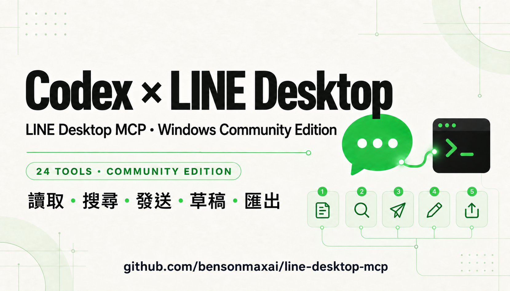
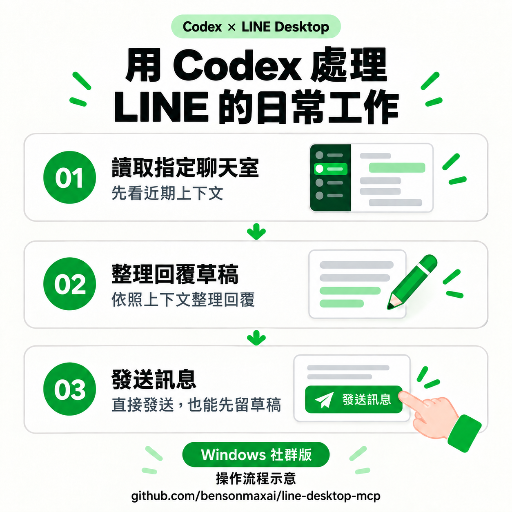
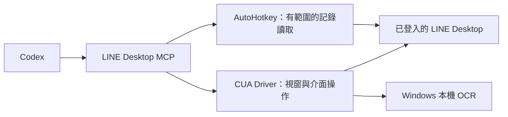

<p align="center">
  
</p>

<h1 align="center">Codex × LINE Desktop</h1>

<p align="center">用 Codex 讀取聊天、搜尋訊息、發送回覆、管理草稿。<br>LINE Desktop MCP · Windows 社群版</p>

<p align="center">
  
  
  <a href="LICENSE.md"></a>
</p>

<p align="center">
  <a href="docs/quickstart-windows.md">開始使用</a> ·
  <a href="https://github.com/bensonmaxai/line-desktop-mcp/releases/tag/v1.2.0">下載 v1.2.0</a> ·
  <a href="docs/features.md">功能介紹</a> ·
  <a href="docs/windows-extensions.md">工具與驗證細節</a> ·
  <a href="docs/README.en.md">English</a>
</p>

---

這是我們搭配 **Codex** 在本機持續使用、整理後公開分享的 Windows 社群版。透過已登入的 LINE Desktop 與 MCP，讓 Codex 協助讀取指定聊天室、搜尋訊息、發送回覆、管理草稿與匯出工作紀錄。

專案由 [bensonmaxai](https://github.com/bensonmaxai/line-desktop-mcp) 維護，透過桌面介面操作 LINE。其他支援本機 MCP 的客戶端也能串接；我們的日常工作流程與介紹以 Codex 為主。

Windows 設定 `LINE_MCP_EXTENSIONS=1` 後，可使用 **24 個工具**。預設保留原本的 **5 個工具**；macOS 也維持原本介面。介面操作工具需要另外設定相容的 CUA Driver。

**從整理訊息到發送回覆，可直接送出，也可先保留草稿。** 想知道各工具的用途與操作例子，可以直接看[完整功能介紹](docs/features.md)。

## 可以拿來做什麼

| 工作 | 這次擴充提供的能力 |
| --- | --- |
| 整理近期聊天 | 將 LINE 已載入的聊天記錄整理成結構化資料，依日期與筆數篩選 |
| 找出需要的訊息 | 在本次讀取範圍內，以文字、發話者或日期搜尋；未知欄位會保留警示 |
| 保存工作紀錄 | 匯出 TXT、JSON、CSV，檢查新檔寫入與 SHA-256；保護既有檔案 |
| 發送訊息 | 向指定聊天室發送完整文字，保留多行與 Unicode 內容；也能改用草稿模式 |
| 準備回覆 | 讀取、寫入、讀回與清除草稿，避免覆蓋使用者已修改的內容 |
| 訊息回覆與轉傳 | 準備引用回覆、複製或翻譯指定訊息、開啟轉傳對象選擇；送出前保留確認步驟 |
| 串接介面操作 | 觀察指定聊天室、開啟搜尋、記事本、相簿、投票、媒體、檔案、連結等面板；依該客戶端可辨識的控制項操作 |

例如，你可以直接對 Codex 說「整理指定聊天室近期十則訊息，列出需要回覆的事項」，再接著要求它整理回覆、發送文字或匯出紀錄。

## 回覆流程

<p align="center">
  
</p>

支援兩種方式：`send_message_auto` 直接發送指定文字；`send_message_manual` 先放入 LINE 輸入框保留為草稿。你可以依需求選擇，把近期聊天讀取、回覆整理與訊息發送串成自己的流程。

## 開始使用

先準備已登入的 Windows LINE Desktop、Node.js 與 AutoHotkey v2。UI 工具另需 CUA Driver；前置作業與 MCP 設定見 [Windows 安裝指南](docs/quickstart-windows.md)。

使用固定版本取得程式：

```powershell
git clone --branch v1.2.0 --depth 1 https://github.com/bensonmaxai/line-desktop-mcp.git
cd line-desktop-mcp
npm install --ignore-scripts
```

用 Codex CLI 加入這個 MCP server，啟用擴充並填入自己的 CUA 執行檔路徑：

```powershell
codex mcp add line-desktop-mcp --env LINE_MCP_EXTENSIONS=1 --env LINE_MCP_CUA_DRIVER=C:/Tools/cua-driver/cua-driver.exe -- node C:/Tools/line-desktop-mcp/src/server.js
codex mcp get line-desktop-mcp
```

以上路徑是範例，請換成自己的絕對路徑。讓 Codex 重新連線後，先呼叫 `get_line_capabilities` 查看 24 個工具與能力說明；這個查詢不會讀取聊天內容。其他 MCP 客戶端的 JSON 設定也列在安裝指南。

也可以下載 [GitHub Release 的 npm tarball](https://github.com/bensonmaxai/line-desktop-mcp/releases/tag/v1.2.0)。本社群版本透過 GitHub 發布；`npx line-desktop-mcp@latest` 仍指向原作者的 npm 套件，既有 MCPB 也不會自動安裝這個版本。

## 維護與驗證

| 層次 | 證據與範圍 |
| --- | --- |
| 自動測試 | `npm test`：93 項通過，涵蓋協定相容性、篩選／匯出、草稿與視窗保護、AHK 產生、跨程序鎖與無互動啟動 |
| 實際封裝 | npm tarball 乾淨安裝後，透過真正的 stdio 入口確認預設 5 個工具、啟用後 24 個工具 |
| 日常使用 | 維護者已在本機持續使用聊天讀取與訊息發送流程 |
| 本輪擴充驗證 | 近期記錄、日期／文字搜尋、精確文字存在、匯出，以及多行草稿寫入／讀回／清除；搜尋面板開啟與狀態確認 |
| 測試環境 | Node.js 24.16.0、Windows LINE 26.4.2.3957、CUA Driver 0.23.2；其他版本須自行確認相容性 |

<details>
<summary>客戶端相容性與本次驗證範圍</summary>

- 記錄讀取限於 LINE 當下已載入的內容，匯出檔案不能還原成 LINE 帳號備份。
- 小字與自繪選單可能無法穩定辨識。投票、記事本等面板仍可能回傳無法確認，不會猜座標繼續操作。
- 引用回覆、複製、翻譯、轉傳與附件工具，尚未完成所有客戶端的實機驗證。
- 真實藍色提及、成員名單、表情回應、收回、通話與群組共用內容建立，目前保留為需視覺操作的流程。
- 本輪新增擴充的測試範圍另外列在技術文件；macOS 維持原介面，這輪只做協定相容性測試。

詳見 [完整驗證紀錄與行為界線](docs/windows-extensions.md#live-verification-and-remaining-limits)。

</details>

## 24 個工具

<details>
<summary>展開工具清單</summary>

| 類別 | 工具 |
| --- | --- |
| 記錄與搜尋 | `get_line_chatroom_history_short`、`get_line_chatroom_history_default`、`get_line_chatroom_history_long`、`get_line_chat_messages`、`search_line_chat_messages`、`verify_line_message`、`export_line_chat_history` |
| 能力與觀察 | `get_line_capabilities`、`get_line_workflow`、`get_line_status`、`open_line_chat`、`get_line_ui_state`、`confirm_line_chat_view` |
| 草稿與傳送 | `get_line_draft`、`set_line_draft`、`clear_line_draft`、`send_message_manual`、`send_message_auto`、`send_file_manual` |
| 介面與訊息操作 | `open_line_chat_feature`、`stage_line_reply`、`copy_line_message`、`translate_line_message`、`stage_line_forward` |

`get_line_workflow` 只提供操作指引，不會自行執行。`verify_line_message` 僅確認指定範圍內存在相同文字，不能證明剛才成功送達。附件工具只填入檔案選擇視窗；按下「開啟」才跨入實際傳送步驟。

</details>

## 它如何運作



橋接程式的 OCR 在本機執行，不使用雲端 OCR。AI 客戶端如何處理工具回傳內容，取決於你所使用的客戶端與模型設定。

## 開發與回報

```powershell
npm test
```

測試使用合成訊息與模擬介面，不會讀取真實聊天室或送訊息。Windows OCR 測試使用本機產生的圖片。

歡迎透過 [Issues](https://github.com/bensonmaxai/line-desktop-mcp/issues) 回報問題，附上作業系統、LINE／Node／CUA 版本、工具名稱和去識別化錯誤資訊即可。請不要放入真實聊天內容或帳號資料。

## 致謝與授權

原始專案由 [Geoffrey Wang（dtwang）](https://github.com/dtwang/line-desktop-mcp) 開發。本 fork 由 [bensonmaxai](https://github.com/bensonmaxai) 維護 Windows 擴充與發布文件；核心擴充已回饋至 [upstream PR #4](https://github.com/dtwang/line-desktop-mcp/pull/4)。

採用 [MIT License](LICENSE.md)，保留原作者著作權聲明。本專案與 LINE 官方無關。README 圖片為 AI 生成的功能示意，並非 LINE 實際介面截圖或官方素材。
